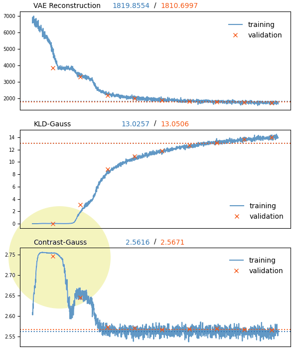
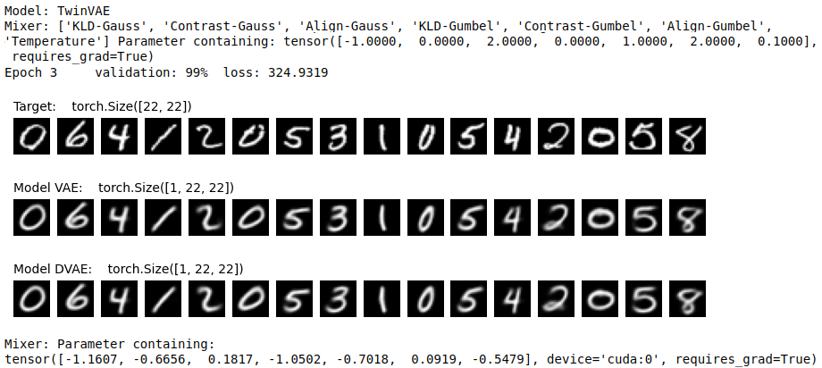
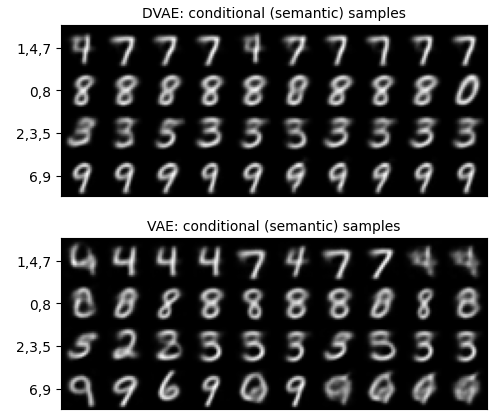
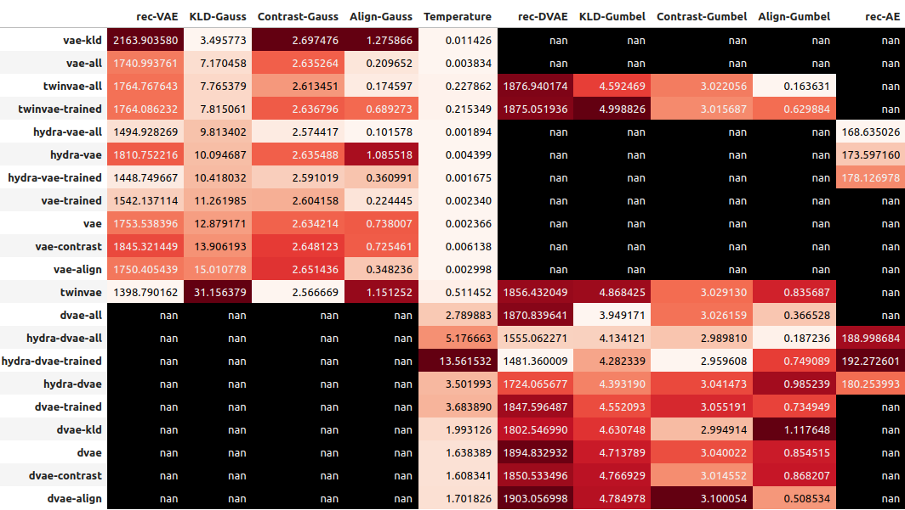

# AE-LEGO
Intention of this toy example is to get visual insights into dynamics of the hybrid (Neural Net + Probabilistic Model) training. Our point of interest is the encoding-layers with generative capabilities and some arbitrary semantic noisy channel (context). The layers could be parts of other models, may be cascaded, or be models stand alone. In these experiments we assume that we do not really know what the data is but rather trying to make the best sense of it given some predefined "perceptual" capacity.

Training variational auto-encoders (VAEs) can be difficult, and knowing the data is important for choosing the optimal setup. Here we are looking for the signals which could help to find it. We introduce a few helper terms useful for the training state diagnostics.

 

### [Blocks:](notebooks/AE-LEGO.ipynb)
This notebook defines a set of building blocks to play with.

* [Dataset](notebooks/AE-LEGO.ipynb#data)
* [Models](notebooks/AE-LEGO.ipynb#model)
    * [Semantic context](notebooks/AE-LEGO.ipynb#semantic) (conditional VAE)
    * [Auto-Encoder](notebooks/AE-LEGO.ipynb#ae)
    * [Vanilla VAE](notebooks/AE-LEGO.ipynb#vae)
    * [Discrete VAE](notebooks/AE-LEGO.ipynb#dvae)
    * [Fancy beasts](notebooks/AE-LEGO.ipynb#beasts)
        * [TwinVAE](notebooks/AE-LEGO.ipynb#twin)
        * [HydraVAE](notebooks/AE-LEGO.ipynb#hydra)
* [Loss Definition](notebooks/AE-LEGO.ipynb#loss)
    * [Reconstruction](notebooks/AE-LEGO.ipynb#rec)
    * [KL-diversion](notebooks/AE-LEGO.ipynb#kld)
        * [VAE](notebooks/AE-LEGO.ipynb#kld)
        * [DVAE](notebooks/AE-LEGO.ipynb#kld-dvae)
    * [Contrast metric](notebooks/AE-LEGO.ipynb#contrast)
    * [Semantic align](notebooks/AE-LEGO.ipynb#align)
    * [Temperature](notebooks/AE-LEGO.ipynb#tau)
    
### [Exploration setup:](notebooks/AE-Experiments-Setup.ipynb)
This notebook defines exploration utilities.

* [Dataset](notebooks/AE-Experiments-Setup.ipynb#data)
* [Loss exploration setup](notebooks/AE-Experiments-Setup.ipynb#loss)
* [Experiment setup](notebooks/AE-Experiments-Setup.ipynb#exp)
* [Test run](notebooks/AE-Experiments-Setup.ipynb#test):
    * [VAE](notebooks/AE-Experiments-Setup.ipynb#vae): [reconstruction only; low weight](notebooks/AE-Experiments-Setup.ipynb#vae)
    * [VAE](notebooks/AE-Experiments-Setup.ipynb#vae): [reconstruction only; with different weight](notebooks/AE-Experiments-Setup.ipynb#vae1)
    * [DVAE](notebooks/AE-Experiments-Setup.ipynb#dvae): [reconstruction only; low weight](notebooks/AE-Experiments-Setup.ipynb#dvae)
    * [DVAE](notebooks/AE-Experiments-Setup.ipynb#dvae): [reconstruction only; with different weight](notebooks/AE-Experiments-Setup.ipynb#dvae1)
    * [Twin-VAE](notebooks/AE-Experiments-Setup.ipynb#twin): [reconstruction only; low weight](notebooks/AE-Experiments-Setup.ipynb#twin)
    * [Hydra-VAE](notebooks/AE-Experiments-Setup.ipynb#hvae): [reconstruction only; low weight](notebooks/AE-Experiments-Setup.ipynb#hvae)
    * [Hydra-DVAE](notebooks/AE-Experiments-Setup.ipynb#hdvae): [reconstruction only; low weight](notebooks/AE-Experiments-Setup.ipynb#hdvae)
    
### [Experiments:](notebooks/AE-Experiments.ipynb)
This notebook takes dive into training a diverse set of variational encoders.

* [Fixed parameters experiments](notebooks/AE-Experiments.ipynb#fixed):
    * 1. [VAE](notebooks/AE-Experiments.ipynb#1): [no regularization](notebooks/AE-Experiments.ipynb#1)
    * 2. [VAE](notebooks/AE-Experiments.ipynb#1): [KL-diversion regularization](notebooks/AE-Experiments.ipynb#2)
    * 3. [VAE](notebooks/AE-Experiments.ipynb#1): [contrast](notebooks/AE-Experiments.ipynb#3)
    * 4. [VAE](notebooks/AE-Experiments.ipynb#1): [semantic align](notebooks/AE-Experiments.ipynb#4)
    * 5. [VAE](notebooks/AE-Experiments.ipynb#1): [all terms](notebooks/AE-Experiments.ipynb#5)
    * 6. [DVAE](notebooks/AE-Experiments.ipynb#6): [no regularization](notebooks/AE-Experiments.ipynb#6)
    * 7. [DVAE](notebooks/AE-Experiments.ipynb#6): [KL-diversion regularization](notebooks/AE-Experiments.ipynb#7)
    * 8. [DVAE](notebooks/AE-Experiments.ipynb#6): [contrast](notebooks/AE-Experiments.ipynb#8)
    * 9. [DVAE](notebooks/AE-Experiments.ipynb#6): [semantic align](notebooks/AE-Experiments.ipynb#9)
    * 10. [DVAE](notebooks/AE-Experiments.ipynb#6): [all terms](notebooks/AE-Experiments.ipynb#10)
* [Siamese experiments](notebooks/AE-Experiments.ipynb#siam):
    * 11. [Twin-VAE](notebooks/AE-Experiments.ipynb#11): [no regularization](notebooks/AE-Experiments.ipynb#11)
    * 12. [Twin-VAE](notebooks/AE-Experiments.ipynb#11): [all terms](notebooks/AE-Experiments.ipynb#12)
    * 13. [Hydra-VAE](notebooks/AE-Experiments.ipynb#13): [no regularization](notebooks/AE-Experiments.ipynb#13)
    * 14. [Hydra-VAE](notebooks/AE-Experiments.ipynb#13): [all terms](notebooks/AE-Experiments.ipynb#14)
    * 15. [Hydra-DVAE](notebooks/AE-Experiments.ipynb#15): [no regularization](notebooks/AE-Experiments.ipynb#15)
    * 16. [Hydra-DVAE](notebooks/AE-Experiments.ipynb#15): [all terms](notebooks/AE-Experiments.ipynb#16)
* [Trainable balance experiments](notebooks/AE-Experiments.ipynb#train):
    * 17. [VAE](notebooks/AE-Experiments.ipynb#17)
    * 18. [DVAE](notebooks/AE-Experiments.ipynb#18)
    * 18. [Twin-VAE](notebooks/AE-Experiments.ipynb#19)
    * 20. [Hydra-VAE](notebooks/AE-Experiments.ipynb#20)
    * 21. [Hydra-DVAE](notebooks/AE-Experiments.ipynb#21)
* [Compare results](notebooks/AE-Experiments.ipynb#res)

### [No-Context experiments:](notebooks/AE-Experiments-Base.ipynb)
This notebook contains the same experiments as above without semantic channel.

### [Tensorboard logging:](notebooks/AE-Experiments-Tensorboard.ipynb)
This notebook uses refined post-R&D loss-function and `tensorboard` logging.

<!--img align="left" src="notebooks/assets/tensorboard.png" /> 

### Output

 

 

 

The notebooks with full output for a set of configurations:

* [`latent=3  categorical=10 encoder-semantic=0  decoder-semantic=0`](https://arcta.me/projects/dustbin/ae-lego-output/AE-Experiments-3-10-0.html)
* [`latent=3  categorical=10 encoder-semantic=4  decoder-semantic=4`](https://arcta.me/projects/dustbin/ae-lego-output/AE-Experiments-3-10-4.html)
* [`latent=4  categorical=4  encoder-semantic=10 decoder-semantic=10`](https://arcta.me/projects/dustbin/ae-lego-output/AE-Experiments-4-4-10.html)
* [`latent=18 categorical=16 encoder-semantic=10 decoder-semantic=10`](https://arcta.me/projects/dustbin/ae-lego-output/AE-Experiments-16-16-10.html)
* [`latent=8  categorical=10 encoder-semantic=10 decoder-semantic=10`](https://arcta.me/projects/dustbin/ae-lego-output/AE-Experiments-8-10-10.html)
* [`latent=4  categorical=8  encoder-semantic=0  decoder-semantic=10`](https://arcta.me/projects/dustbin/ae-lego-output/AE-Experiments-4-8-d10.html)

### Environment
We used PyTorch 2.0 for experiments.

      ├── requirements.txt
      ├── env.cnf
      ├── Dockerfile
      └── notebooks/
            ├── data
            ├── output
            ├── runs
            └── scripts/
                  ├── aelego.py
                  ├── experiment.py
                  └── utils.py
                  

To run in `docker` with CUDA and `tensorboard` build example:

    docker build --no-cache 
                 --build-arg USER_NAME=${USER_NAME} \
                 --build-arg PYTHON=python3.10 \
                 -t ${CONTAINER_NAME} .

Run with configuration file example:

    docker run -it -d -p ${PORT}:${PORT} -p 6006:6006 -v ${WORKDIR}/notebooks:/home/${USER_NAME}/notebooks \
               --gpus all --env-file ${WORKDIR}/env.cnf \
               --name ${CONTAINER_NAME} --restart unless-stopped ${CONTAINER_NAME}

@misc{Arctalex2023,
  author = {Arce Alexandra},
  title = {AE-LEGO},
  year = {2023},
  publisher = {GitHub},
  journal = {GitHub repository},
  howpublished = {\url{https://github.com/arcta/ae-lego}}
}
